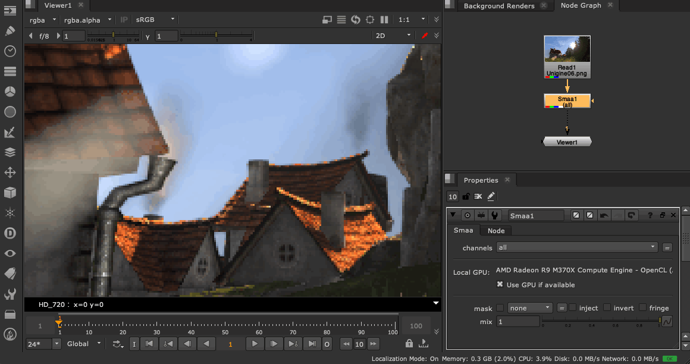

# SMAA for Nuke

SMAA (Enhanced Subpixel Morphological Antialiasing) post-processing plugin for 
Nuke using Blink API.



## Building

Build the plugin as follow:

```bash
cd smaa-nuke
mkdir build && cd build
cmake -DCMAKE_INSTALL_PREFIX=/tmp ..
make && make install
```

A specific Nuke version can be targeted as follow:

 ```
cmake -DNUKE_PATH=/path/to/nuke -DCMAKE_INSTALL_PREFIX=/tmp ..
 ```

## Installing

Once the plugin is built, copy the shared library (*Smaa.so* or *Smaa.dylib* for 
masOS) into your personal `~/.nuke` folder (or update your `NUKE_PATH` 
environment variable) and add the following `menu.py` file:

```python
import nuke

toolbar = nuke.menu("Nodes")
toolbar.addCommand("Filter/Smaa", "nuke.createNode('Smaa')")
```

see also: [Defining the Nuke Plug-in Path](https://learn.foundry.com/nuke/content/comp_environment/configuring_nuke/defining_nuke_plugin_path.html)

## Attributions

Jorge Jimenez et al. (2013). Enhanced Subpixel Morphological Antialiasing.
http://www.iryoku.com/smaa/
